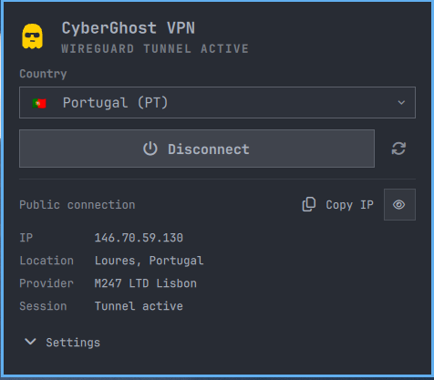
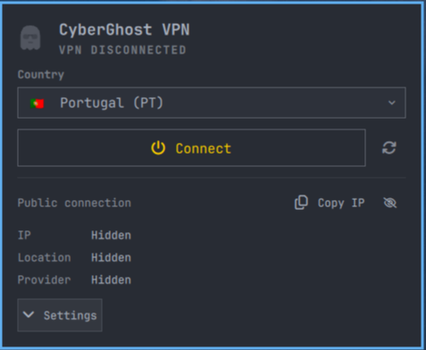

# CyberGhost VPN for Omarchy Shell

A native, lightweight status bar widget and popup panel for managing **CyberGhost VPN** on Omarchy / Arch Linux, built on Quickshell.

---

## ✨ Features

### Status Bar Widget
- 👻 Custom CyberGhost vector icon (brand yellow `#FFCE00` when connected).
- 🟢 Active indicator dot; pulsing dot during connect/disconnect handshakes.
- ⚠️ Warning badge if the tunnel's WireGuard handshake goes stale (>3 min) plus a desktop notification.
- 📎 Informative tooltips: connection state, country, flag and public IP.
- 🖱️ **Middle-click or right-click** toggles the VPN instantly; **left-click** opens the panel.

### Popup Panel
- 🧙 **First-run wizard first**: until dependencies, an account and the fixed root helper are ready, the panel shows *only* setup — one-click installs, native account form and an optional passwordless-rule toggle. Everything else appears once you're ready.
- ⚡ **One-click connect/disconnect** via header power switch or action button.
- 🔍 **Connection details card** — clean stacked view of:
  - **IP** — live public IP with click-to-copy.
  - **Location** — city + country resolved from GeoIP.
  - **Provider** — ISP/network organization.
  - **Session** — transfer totals, handshake freshness and VPN endpoint while connected.
   - Compact status badge (`PROTECTED` / `IP EXPOSED`) and active protocol pill; the hero and details card provide the full context.
 - 🙈 **Privacy mode** — one click on the 👁 Hide button (in the details card) masks the IP, location, provider and session info; also hides the IP from the bar tooltip. Persists across restarts.
- 🌍 **Country switching:**
  - Compact quick-connect grid with 8 popular locations (instant connect).
  - Searchable country dropdown covering the supported 90+ CyberGhost countries (the long list is only loaded inside the popup).
  - Live server selector with **Fastest available** (lowest reported load) or an exact manual server instance.
  - The manual list is loaded only for the selected country, so opening the panel does not enumerate every server globally.
- 🛡️ **Server modes:** ⚡ Traffic · 🔒 Torrent (P2P) · 🎬 Streaming.
- Streaming mode loads the available service profiles for the selected country from the official CLI before connecting.
- 🔒 **Protocols:** WireGuard · OpenVPN UDP · OpenVPN TCP.
  - Changing mode or protocol while connected never tears down the live tunnel — it applies on the next connect.
- 🔔 Desktop notifications on connect, disconnect, errors and stale-handshake warnings.
- ℹ️ Error/status banner with human-readable messages.
- ⌨️ Keyboard-tabbable controls, labelled account fields, responsive wrapping and a scrollable panel for small screens.
- ♿ Reduced-motion setting disables the connection pulses without changing status feedback.
- 💾 Last country / protocol / server mode / manual server selection are remembered across restarts when still available.

### Screenshots

The panel in connected and disconnected states. Public IP details are masked in these captures.





## 🧠 How It Works

| Mode | Backend |
|---|---|
| WireGuard + Traffic | **Native API + `wg-quick`**: uses strict-TLS key exchange and the current per-country server inventory when `cyberghostvpn` is installed; it selects the lowest-load instance by default and accepts an exact manual instance. Static city fallbacks remain available without the CLI. The tunnel covers **IPv4 and IPv6** (`0.0.0.0/0, ::/0`), so there is no v6 leak. |
| OpenVPN UDP/TCP, Torrent, Streaming | **Delegated** to the official `cyberghostvpn` CLI. |

Security posture:
- Key-exchange requests use **strict TLS verification** — if the certificate chain or hostname fails, credentials are never sent. The official CLI is used for server inventory and for CLI-only modes; the actual WireGuard tunnel is created by the native `wg-quick` path.
- Strict validation of all WireGuard configuration fields (keys, IP addresses, ports, hostnames, DNS) prevents newline or directive injection (`PreUp`/`PostUp`).
- The account API app key is a vendor-published client identifier, not an account secret; set `CG_APP_KEY` if CyberGhost rotates it before this plugin is updated.
- A **handshake watchdog** warns you (notification + bar badge) when the tunnel stops handshaking, instead of silently leaking traffic.
- The widget never executes mutable plugin code through `pkexec`: the installed helper is root-owned, capability- and version-checked and accepts only `connect`/`disconnect` with fixed paths. The optional Polkit rule is pinned to that helper. Reinstall the helper after plugin updates; setup detects stale helper versions.
- Account passwords are used only for registration and are **never written to the config file**; only the account identifier and device token/secret are stored with owner-only permissions.
- Subprocess, HTTP, CLI and UI output is bounded and time-limited so a stalled or unexpectedly large response cannot hang the panel or consume unbounded memory.

The widget polls VPN status using the runner's JSON output and checks your public IP/GeoIP via ipwho.is — throttled to at most one request per 20s while connected (plus a forced refresh when the panel opens or you disconnect), well within free API limits. The panel keeps the selected CyberGhost target separate from the public IP's GeoIP result because commercial IP ranges can be registered differently by different databases.

```
Panel.qml (UI) ──> Service.qml (state machine) ──> pkexec ──> /usr/local/bin/cyberghost-runner (root helper)
                         └─> ServiceUtils.js (pure bounded-output/result helpers)
```

`Service.qml` owns connection state and process orchestration; `ServiceUtils.js` contains the small, side-effect-free parsing and bounding helpers; the Python runner owns validation, API access and privileged tunnel lifecycle.

---

## 📦 Requirements

1. **WireGuard tools**: `sudo pacman -S wireguard-tools`
2. **Python 3.9+** and **requests** (native key exchange + account registration): `sudo pacman -S python-requests`
3. A CyberGhost subscription — account linking happens **in the widget** (native API, no CLI).
4. *(Recommended)* `cyberghostvpn` CLI — used for live server inventory and exact server selection, and required at runtime for OpenVPN / torrent / streaming modes; Streaming also uses it to load service profiles.
5. A root-owned helper installed at `/usr/local/bin/cyberghost-runner` — required by the widget for safe connect/disconnect. The bundled Polkit rule is optional and only removes repeated password prompts.

> CLI-backed modes use the official CLI's own setup. If you enable OpenVPN, Torrent or Streaming, install and configure it separately with the vendor's setup flow (for example `sudo cyberghostvpn --setup`); linking the native account in this widget does not configure that CLI. The optional AUR package is a separate supply-chain choice—review and trust its PKGBUILD first.

> The widget can be installed before it is configured and shows a **setup wizard in its panel**. Use the setup actions to install dependencies and link the account. The helper step opens a visible terminal and asks for sudo explicitly; the optional Polkit rule then enables passwordless lifecycle actions.

---

## 🚀 Installation

**Quick start (2 commands):**

```bash
omarchy plugin add https://github.com/27mfp/miguel.cyberghost.git --enable
bash ~/.config/omarchy/plugins/miguel.cyberghost/install.sh
```

The first command installs and places the widget on your bar (Omarchy asks which section; it defaults to *right*). The second checks dependencies and offers to install what's missing — every step asks before changing anything, and it's safe to re-run. Or skip the script entirely: open the widget and follow the **FIRST-RUN SETUP** panel.

Or clone manually:

```bash
git clone https://github.com/27mfp/miguel.cyberghost.git ~/.config/omarchy/plugins/miguel.cyberghost
omarchy plugin enable miguel.cyberghost right
```

---

## 🗑️ Removal

```bash
qs ipc call miguel.cyberghost disconnect                 # only if connected
omarchy plugin disable miguel.cyberghost
omarchy plugin remove miguel.cyberghost --yes            # removes from bar + plugins dir
sudo rm -f /etc/polkit-1/rules.d/50-cyberghost.rules /usr/local/bin/cyberghost-runner  # helper/rule
sudo rm -f /etc/wireguard/cyberghost.conf                 # any native config left after an interrupted removal
rm -rf ~/.cyberghost                                       # account identifier/device token (optional)
```

---

## ⚙️ Settings

Configurable from the Omarchy plugin settings:

| Key | Type | Default | Description |
|---|---|---|---|
| `refreshIntervalSec` | int (5–60) | `8` | Status polling interval in seconds |
| `defaultCountry` | string | `PT` | Country code used on first connect (e.g. `PT`, `US`, `DE`) |
| `serverSelection` | string | `fastest` | Lowest-load server or an exact live instance name |
| `protocol` | string | `wireguard` | `wireguard`, `openvpn` (UDP) or `openvpn_tcp` |
| `serverType` | string | `traffic` | `traffic`, `torrent` or `streaming` |
| `hideDetails` | bool | `false` | Mask IP / location / provider / session in the panel and bar tooltip |
| `reduceMotion` | bool | `false` | Disable pulsing connection indicators |

---

## 🎮 IPC Commands

Control the plugin from scripts or keybindings via `qs ipc`:

```bash
qs ipc call miguel.cyberghost toggle      # open/close the panel
qs ipc call miguel.cyberghost connect     # connect to current/default country
qs ipc call miguel.cyberghost connect US  # connect to a specific country
qs ipc call miguel.cyberghost disconnect  # disconnect the VPN
qs ipc call miguel.cyberghost refresh     # force a status + IP refresh
```

Example Hyprland keybinding:

```ini
bind = SUPER, V, exec, qs ipc call miguel.cyberghost connect
```

---

## 🔐 Root helper and passwordless connection via Polkit

The widget requires a fixed root-owned helper for connect/disconnect. Without the optional rule, `pkexec` asks for authorization when the helper is used. Install the helper (and, by default, the optional rule) from a visible terminal:

```bash
bash ./install-helper.sh
```

The rule grants only members of `wheel` passwordless access to the exact helper path. The helper rejects `register`, `status`, `check`, custom config paths and arbitrary command arguments. From the widget, choose **Open installer**, complete the visible terminal step, then choose **Recheck setup**. The panel never passes a user-editable plugin path to `pkexec` for a root install operation.

The Polkit rule is optional. The installer enables it by default, or install only the required helper with:

```bash
bash ./install-helper.sh --no-polkit-rule
```

Without the rule, `pkexec` asks for authorization for each lifecycle action. With it enabled, any process running as a member of `wheel` can connect or disconnect this user's VPN without another prompt; install it only if that trade-off is appropriate for your machine.

For the helper-only step from a terminal:

```bash
bash ~/.config/omarchy/plugins/miguel.cyberghost/install-helper.sh --no-polkit-rule
```

The account password is not saved. Registration sends it once over the setup process's stdin; subsequent native WireGuard connections use the device token and secret.

---

## 🧪 Development

The recommended workflow is to keep the repo anywhere (e.g. `~/Code/miguel.cyberghost`) and symlink it into the plugins directory, so edits take effect without re-copying files:

```bash
ln -s ~/Code/miguel.cyberghost ~/.config/omarchy/plugins/miguel.cyberghost
omarchy restart shell   # reload after changes
```

Run the backend standalone (Python 3.9 or newer):

```bash
python3 cyberghost_runner.py status --json
sudo python3 cyberghost_runner.py connect --country PT --protocol wireguard --server-type traffic
python3 cyberghost_runner.py --help
```

The installer creates a private, read-only snapshot of the helper and rule before requesting sudo, then copies each into a root-only staging directory and verifies its SHA-256 digest before installing either final file. Re-run `install-helper.sh` after updating the plugin so the privileged backend receives the same fixes as the UI.

The direct `sudo` command is a developer diagnostic path. The installed widget uses `pkexec /usr/local/bin/cyberghost-runner`; do not expose the development runner through a broad Polkit rule.

Lint and tests (also enforced by CI):

```bash
ruff check .
ruff format --check .
pytest -q            # or: python3 tests/test_runner.py
shellcheck install.sh install-helper.sh fresh-install.sh
for f in Panel.qml Service.qml GhostIcon.qml tests/qml/*.qml; do diff -u "$f" <(qmlformat --settings .qmlformat.ini "$f"); done
```

CI also runs `shellcheck`, `qmllint`, `qmlformat` and the QML unit tests.

Simulate a brand-new user (destructive: disconnects the tunnel and removes the plugin, helper/rule and credentials, then reinstalls from GitHub — finish setup through the widget's first-run wizard):

```bash
bash fresh-install.sh              # reinstall from GitHub like an external user
bash fresh-install.sh --local      # install the local checkout instead
bash fresh-install.sh --purge-deps # also remove wireguard-tools/python-requests
```

---

## 🧯 Troubleshooting

| Symptom | Fix |
|---|---|
| "FIRST-RUN SETUP" checklist in panel | Run `bash ~/.config/omarchy/plugins/miguel.cyberghost/install.sh` or follow the hints next to each unchecked item |
| "Configuration file not found" | Link the account in the widget, or place owner-only device credentials in `~/.cyberghost/config.ini` under `[device]` (`token`, `secret`) |
| Authentication failed on connect | Check your CyberGhost subscription / re-run setup |
| WireGuard reports a certificate/endpoint error | Check the account link and TLS/network access; the widget uses the native WireGuard path and the CLI only for current server inventory |
| Connect works, but no internet | Try the DNS fallback path (runner retries automatically), or switch protocol to WireGuard if on OpenVPN |
| Account link fails in the wizard | Check username/password; the CLI is NOT required for this step — it talks to CyberGhost's API natively |
| OpenVPN/Torrent/Streaming fails | Ensure the `cyberghostvpn` CLI is installed and configured with `sudo cyberghostvpn --setup` — those modes are delegated to it |
| IP shows "Unavailable" | ipwho.is may be unreachable/rate-limited; hit **Refresh Status** |

---

## 📄 License

MIT License — see [LICENSE](LICENSE) for details.
