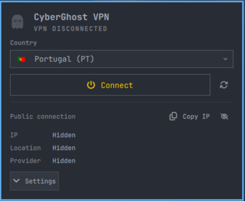
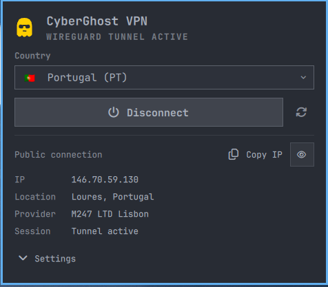

# CyberGhost VPN for Omarchy

<p align="center"></p>

A WireGuard VPN plugin for the Omarchy bar. Choose a country and connect with one click. The tunnel is an ordinary NetworkManager connection, so on Omarchy it needs no root helper, no extra system packages and no password prompt.

[Open the CyberGhost plugin in the Omarchy plugin directory](https://plugins.omarchy.org/plugin.html?id=miguel.cyberghost)

## Preview

<p align="center">
  
  
</p>

## Install

```bash
omarchy plugin add https://github.com/27mfp/miguel.cyberghost.git --enable
```

Open the ghost icon and complete the setup steps:

1. If `python-requests` is missing, install it from the panel (it opens Omarchy's floating terminal).
2. Link your CyberGhost account. Native credentials are stored in `~/.cyberghost/native.ini`.

That's it: connecting uses NetworkManager, which Omarchy already runs, and its Polkit policy already lets your desktop session manage network connections. You can also run `bash install.sh` from a checkout for guided setup. The vendor CLI is not required.

## Use

- Select a country under **Location**.
- While connected, the tunnel also appears as **CyberGhost VPN** in `nmcli` and Omarchy's network tools. It lives only in memory and is gone after a NetworkManager restart or reboot.
- Selecting a country alone never reconnects.
- Use the switch in the panel header to connect or disconnect. If you pick a different country while connected, **Switch to …** moves the tunnel in one click; choosing a country alone never reconnects.
- Panel shortcuts: `t` or Enter toggles the VPN, `c` copies the public IP (or click the IP), `h` hides details, `r` refreshes, Esc closes.
- **Account → Log out** forgets this device's login (`~/.cyberghost/native.ini`) after a second confirming click, disconnecting first if needed. An account from the CyberGhost CLI's own `config.ini` is shown but left alone. Logging out does not remove the device from your CyberGhost account; do that on CyberGhost's website if you no longer use it.
- Left-click opens the panel; middle- and right-click toggle the VPN.

Server selection is automatic, in this order: the vendor CLI's inventory if installed; CyberGhost's own live server list (least loaded first) while your login session is valid (about a day after **Link account**); otherwise real server names from your local cache, probed for the fastest reachable host. While the session is valid, the plugin fills that cache for every country in the background, from your own account. The Account section shows "syncing servers" with its progress. Nothing needs to be set up or refreshed by hand. Linking your account again refreshes the list.

```bash
python3 ~/.config/omarchy/plugins/miguel.cyberghost/cyberghost_runner.py probe --all
```

## Scope and limits

- Supported mode: native WireGuard traffic connections only.
- OpenVPN, streaming, torrent, and manual-server controls are not supported.
- This is not a kill switch and does not claim leak protection or anonymity.
- VPN DNS is set exclusively on the tunnel (`~.` routing domain). If you chose a provider with `omarchy dns`, Omarchy's global DNS still applies and those queries travel through the tunnel.
- A separate vendor VPN session is not managed by this plugin.
- Public-IP lookup uses `ipwho.is`; privacy mode only masks the displayed values.

The plugin preserves the vendor's `~/.cyberghost/config.ini`. Disconnect before removing or upgrading from an experimental vendor-based version.

## Update and remove

```bash
omarchy plugin update miguel.cyberghost
```

Updates need no extra step. **Upgrading from 1.6.x or earlier:** disconnect once (the old helper removes its own tunnel), then use **Settings → Advanced → Remove old root helper…**, or run `bash scripts/remove-legacy-helper.sh`. Disconnect before removal. See the [installer reference](INSTALLER.md) for details.

## Development

```bash
pytest -q
ruff check .
ruff format --check .
bash scripts/test-qml.sh
```

Read the [release checklist](docs/release-checklist.md), [architecture](docs/architecture.md), and [testing guide](docs/testing.md) for additional details. The repository contains experimental vendor compatibility code, but it is not part of the supported release.
